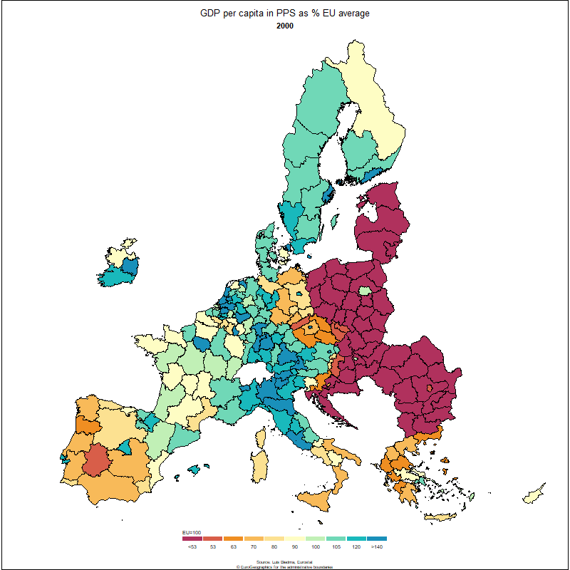

A map on Regional GDP - 2000-2020
================

I am going to use the following libraries:

``` r
library(tidyverse)
library(giscoR) # for maps
library(dataregacc) # available with remotes::install_github("Luisbia/dataregacc")
library(gganimate) #
library(data.table)
```

We get the geographical information from the regions with `{giscoR}`

``` r
# get EU27 country codes
eu2021 <- gisco_countrycode[gisco_countrycode$eu, ]$CNTR_CODE 

# get NUTS 2 geometry
nuts2 <- gisco_get_nuts(
  year = "2021",
  epsg = "3035",
  resolution = "3",
  nuts_level = "2",
  country = eu2021
)

# get borders
borders <- gisco_get_nuts(
  epsg = "3035",
  year = "2021",
  resolution = "3",
  country = eu2021,
  nuts_level = "2"
)
```

And the data from `{dataregacc}`.

``` r
data<- regacc %>% 
  filter(table =="2gdp" &
         NUTS == 2 &
         unit == "PPS_HAB_EU27_2020" &
         country %in% eu2021) %>% 
  select(geo, time,values)
```

We merge the data with the geometry.

``` r
nuts2.sf <- merge(nuts2,
                  data,
                  by.x = "NUTS_ID",
                  by.y = "geo",
                  all.x = TRUE
)
```

It might be helpful to define the classes of the map to use the
`quantile` function.

``` r
# Breaks
classes <- data %>% 
  pull(values) %>% 
  quantile(probs = seq(0, 1, 1/10),na.rm = TRUE)

classes
```

    ##    0%   10%   20%   30%   40%   50%   60%   70%   80%   90%  100% 
    ##  18.0  48.0  64.0  74.0  83.0  92.0 103.0 111.7 122.0 143.0 283.0

We create the breaks.

``` r
br <- c(0,53,63,70,80,90,100,105,120,140,300)
```

and apply them to the data.

``` r
# Cut
nuts2.sf$values_groups <- cut(nuts2.sf$values, breaks = br)
```

And the labels for them. We create a custom text for the first and last
one.

``` r
# Labels
labels <- br
labels[1] <- "<53"
labels[10] <- ">140"
```

We choose a palette

``` r
# Plot
pal <- hcl.colors(length(br), "Spectral")
```

Finally, we create the chart…very much following a template developed by
Milos Popovic:
<https://milospopovic.net/how-to-make-choropleth-map-in-r/>.

``` r
map<- ggplot(nuts2.sf) +
  geom_sf(aes(fill = values_groups), color = NA, alpha = 0.9) +
  geom_sf(data = borders, fill = NA, size = 0.05, color = "black") +
  # Center in Europe: EPSG 3035
  coord_sf(
    xlim = c(2377294, 6500000),
    ylim = c(1413597, 5228510)
  )+
  labs(
    title = "GDP per capita in PPS as % EU average",
    subtitle = "{current_frame}",
    caption = paste0(
      "Source: Luis Biedma, Eurostat\n ", gisco_attributions()
    )
  )+
  scale_fill_manual(
    name = "EU=100",
    values = pal,
    drop = FALSE,
    na.value = "grey",
    labels = labels,
    guide = guide_legend(
      direction = "horizontal",
      keyheight = 0.5,
      keywidth = 2,
      title.position = "top",
      title.hjust = 0,
      label.hjust = .5,
      nrow = 1,
      byrow = TRUE,
      reverse = FALSE,
      label.position = "bottom"
    )
  )+
  theme_void() +
  # Theme
  theme(
    plot.background = element_rect(fill = "white"),
    plot.title = element_text(
      color = "black",
      hjust = 0.5,
      vjust = -1,
    ),
    plot.subtitle = element_text(
      color = "black",
      hjust = 0.5,
      vjust = -2,
      face = "bold"
    ),
    plot.caption = element_text(
      color = "black",
      size = 6,
      hjust = 0.5,
      margin = margin(b = 2, t = 13)
    ),
    legend.text = element_text(
      size = 7,
      color = "black"
    ),
    legend.title = element_text(
      size = 7,
      color = "black"
    ),
    legend.position = c(0.5, 0.02)
  )  +
  transition_manual(time)

animate(map,fps=5,height=800,width=800, duration = 30)
```

<!-- -->

``` r
anim_save("gganimate.gif")
```
